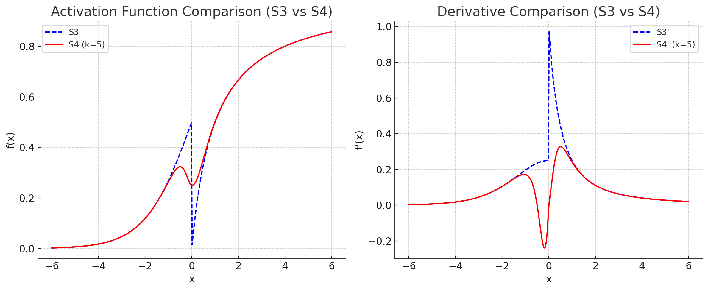

# S3 Activation Function: Mathematical Definition and Analysis

## 1. Mathematical Definition

### 1.1 Core Function

The S3 (**S**igmoid + **S**oft**S**ign) activation function is defined as a piecewise function:

$$
S3(x) = \begin{cases}
\sigma(x) = \frac{1}{1 + e^{-x}}, & \text{if } x \leq 0 \\
\text{softsign}(x) = \frac{x}{1 + |x|}, & \text{if } x > 0
\end{cases}
$$

where:
- $\sigma(x)$ is the sigmoid function  
- $\text{softsign}(x)$ is the softsign function

### 1.2 Derivative

The derivative of S3 is defined as:

$$
S3'(x) = \begin{cases}
\sigma'(x) = \sigma(x)(1 - \sigma(x)) = \frac{e^{-x}}{(1 + e^{-x})^2}, & \text{if } x < 0 \\
\text{undefined}, & \text{if } x = 0 \\
\text{softsign}'(x) = \frac{1}{(1 + |x|)^2}, & \text{if } x > 0
\end{cases}
$$

### 1.3 Continuity Properties

- **Function continuity**: $\lim_{x \to 0^-} S3(x) = \lim_{x \to 0^+} S3(x) = S3(0) = 0.5$
- **Derivative discontinuity**: $\lim_{x \to 0^-} S3'(x) = 0.25 \neq 0.5 = \lim_{x \to 0^+} S3'(x)$

## 2. Key Characteristics

### 2.1 Domain and Range
- **Domain**: $D(S3) = \mathbb{R}$
- **Range**: $E(S3) = (0, 1)$
- **Asymptotes**:  
  - $\lim_{x \to -\infty} S3(x) = 0$  
  - $\lim_{x \to +\infty} S3(x) = 1$

### 2.2 Critical Points
- **Transition point**: $x = 0$, where $S3(0) = 0.5$
- **Monotonicity**: strictly increasing over $\mathbb{R}$
- **Convexity**:  
  - Concave downward for $x < 0$  
  - Concave upward for $x > 0$

### 2.3 Gradient Properties
- **Derivative maximum**:  
  - As $x \to 0^-$: $S3'(x) \to 0.25$  
  - As $x \to 0^+$: $S3'(x) \to 0.5$
- **Gradient behavior**:  
  - For $x < 0$: exponential decay  
  - For $x > 0$: power-law decay $\propto x^{-2}$

## 3. Advantages of the S3 Function

### 3.1 Theoretical Benefits
1. **Avoids vanishing gradient problem** on the positive axis due to softsign’s slower decay
2. **Preserves sigmoid nature** in the negative region
3. **Enhanced expressiveness** from asymmetric behavior
4. **Bounded output range** avoids activation explosion

### 3.2 Practical Strengths
1. **Computational efficiency**: both components are fast to evaluate
2. **Stability**: no exponential growth
3. **Versatility**: applicable to various neural architectures

## 4. Disadvantages of the S3 Function

### 4.1 Critical Weaknesses
1. **Derivative discontinuity at x = 0**: can hinder gradient-based optimization
2. **Non-smoothness**: may introduce training instabilities
3. **Arbitrary transition choice**: no theoretical basis for transition at zero

### 4.2 Practical Limitations
1. **Increased computational complexity**: conditional branches required
2. **Potential convergence issues**: due to non-differentiability
3. **Analysis difficulty**: piecewise nature complicates theoretical studies

## 5. Comparison with Classical Activation Functions

| Property                  | S3  | Sigmoid | Softsign | ReLU  |
|--------------------------|-----|---------|----------|-------|
| Continuity               | ✓   | ✓       | ✓        | ✓     |
| Smoothness               | ✗   | ✓       | ✓        | ✗     |
| Boundedness              | ✓   | ✓       | ✓        | ✗     |
| Vanishing Gradients      | Partial | ✓   | Less     | ✗     |
| Symmetry                 | ✗   | ✗       | ✓        | ✗     |
| Computational Cost       | Medium | High | Low      | Low   |

## 6. Recommendations for Use

### 6.1 Suitable Scenarios
- **Deep networks** requiring balance between sigmoidal and linear behavior
- **Classification tasks**, due to bounded range
- **Hybrid activation experiments**, as a foundational test case

### 6.2 Not Recommended For
- **Tasks demanding smoothness**, due to derivative discontinuity
- **High-precision optimization**, where differentiability is crucial
- **Very deep networks**, due to potential instability

## 7. Possible Modifications

### 7.1 Smoothing the Transition

Introduce a parameter $\epsilon$ for a smooth interpolation:

$$
S3_{\epsilon}(x) = \begin{cases}
\sigma(x), & \text{if } x < -\epsilon \\
\text{interpolation}, & \text{if } -\epsilon \leq x \leq \epsilon \\
\text{softsign}(x), & \text{if } x > \epsilon
\end{cases}
$$

### 7.2 Parameterization

Add trainable parameters to adapt the transition point and scaling dynamically.
Thus, we have come to the description of the new S4 function,
which the author developed as a result of eliminating the shortcomings (disadvantages) of S3.


# S4 Activation Function: Mathematical Definition and Analysis

## 8. Mathematical Definition

### 8.1 Core Function

The S4 (**S**mooth + **S**igmoid + **S**oft**S**ign) activation function is a **smooth extension of S3**,
designed to eliminate the derivative discontinuity at the transition point.
It blends the sigmoid and softsign functions using a smooth switching mechanism:

$$
S4(x) = \alpha(x) \cdot \sigma(x) + (1 - \alpha(x)) \cdot \text{softsign}(x)
$$

where:
- $\sigma(x) = \frac{1}{1 + e^{-x}}$ — sigmoid function  
- $\text{softsign}(x) = \frac{x}{1 + |x|}$ — softsign function  
- $\alpha(x)$ — smooth blending coefficient, typically:
  
$$
\alpha(x) = \frac{1}{1 + e^{k x}}
$$

with $k > 0$ controlling the transition sharpness (larger $k$ → sharper transition).

### 8.2 Derivative

The derivative of S4 is computed using the product rule:

$$
S4'(x) = \alpha'(x) \cdot \sigma(x) + \alpha(x) \cdot \sigma'(x) - \alpha'(x) \cdot \text{softsign}(x) + (1 - \alpha(x)) \cdot \text{softsign}'(x)
$$

where:
- $\sigma'(x) = \frac{e^{-x}}{(1 + e^{-x})^2}$
- $\text{softsign}'(x) = \frac{1}{(1 + |x|)^2}$
- $\alpha'(x) = -k \cdot \alpha(x) \cdot (1 - \alpha(x))$

### 8.3 Continuity Properties

- **Function continuity**: $S4(x)$ is $C^\infty$ (infinitely differentiable) over $\mathbb{R}$
- **Derivative continuity**: smooth across $x = 0$, no jump as in S3
- **Parameter $k$** controls the width of the smooth transition zone

## 9. Key Characteristics

### 9.1 Domain and Range
- **Domain**: $D(S4) = \mathbb{R}$
- **Range**: $E(S4) \subset (0, 1)$ for $\alpha(x)$ in $(0,1)$
- **Asymptotes**:
  - $\lim_{x \to -\infty} S4(x) \to 0$
  - $\lim_{x \to +\infty} S4(x) \to 1$

### 9.2 Critical Points
- **No hard transition** — instead, smooth blending in a region around $x = 0$
- **Monotonicity**: strictly increasing for all $x$
- **Convexity**:  
  - Concave downward for large negative $x$  
  - Concave upward for large positive $x$  
  - Mixed curvature in the transition zone

### 9.3 Gradient Properties
- **Derivative maximum** occurs at $x \approx 0$ but without a sharp jump
- **Gradient behavior**:  
  - Smooth exponential decay in negative region  
  - Smooth power-law decay in positive region

## 10. Advantages of the S4 Function

### 10.1 Theoretical Benefits
1. **Smooth differentiability** — eliminates discontinuity in derivative present in S3
2. **Controlled transition** via parameter $k$  
3. **Stable gradient flow** for optimization
4. **Asymmetric behavior** retained from S3 for richer representational power

### 10.2 Practical Strengths
1. **Better convergence** in gradient-based learning  
2. **Reduced risk of training instability**  
3. **Parameter tuning** allows adaptation to specific tasks  
4. **No branching operations** — pure mathematical composition

## 11. Disadvantages of the S4 Function

### 11.1 Critical Weaknesses
1. **Extra hyperparameter ($k$)** to tune  
2. **Slightly higher computational cost** due to blending term and extra exponentials  
3. **Potential over-smoothing** if $k$ too small — may reduce nonlinearity

### 11.2 Practical Limitations
1. **Not widely implemented in frameworks** (requires custom definition)  
2. **More sensitive to initialization** than S3  
3. **Behavior depends heavily on $k$**

## 12. Comparison with S3 and Classical Activations

| Property                  | S4  | S3  | Sigmoid | Softsign | ReLU  |
|--------------------------|-----|-----|---------|----------|-------|
| Continuity               | ✓   | ✓   | ✓       | ✓        | ✓     |
| Smoothness               | ✓   | ✗   | ✓       | ✓        | ✗     |
| Boundedness              | ✓   | ✓   | ✓       | ✓        | ✗     |
| Vanishing Gradients      | Partial | Partial | ✓   | Less     | ✗     |
| Symmetry                 | ✗   | ✗   | ✗       | ✓        | ✗     |
| Computational Cost       | Medium-High | Medium | High | Low | Low |


### Comparison of S3 vs S4 and their derivatives


## 13. Recommendations for Use

### 13.1 Suitable Scenarios
- **Deep neural networks** where smooth gradient flow is critical  
- **Optimization-sensitive tasks**  
- **Replacements for S3** when derivative discontinuity causes instability  
- **Tasks requiring tunable nonlinearity**

### 13.2 Not Recommended For
- **Resource-constrained environments** with extremely tight compute budgets  
- **When parameter tuning is undesirable**  
- **Very sharp decision boundaries** (may require high $k$)

---
**Summary:**  
S4 provides a smooth, tunable transition between sigmoid and softsign behaviors, retaining the asymmetric benefits of S3 while removing its major weakness — the derivative discontinuity.


## 14. Conclusion

The S3-S4 activation functions represent a novel hybrid approach, combining the strengths of sigmoid and softsign. However, the derivative discontinuity at the transition point imposes serious limitations for practical use. S3 may be valuable in experimental settings but requires careful handling in production environments.

# References

For citing you should use:

Sergii Kavun. (2025). s-kav/s3_s4_activation_function: Version 1.0 (v1.0). Zenodo. https://doi.org/10.5281/zenodo.16459162

[](https://arxiv.org/abs/2507.22090)
[](https://arxiv.org/list/cs.LG/recent)
[](https://doi.org/10.5281/zenodo.16459162)

**Hybrid activation functions for deep neural networks: S3 and S4 -- a novel approach to gradient flow optimization**  
*Sergii Kavun*  
arXiv preprint arXiv:2507.22090, 2025  
[📄 Paper](https://arxiv.org/abs/2507.22090)

**BibTeX formatted citation**

<details>
<summary>📋 Click to expand BibTeX citation</summary>
<br>

```bibtex
@misc{kavun2025hybridactivationfunctionsdeep,
      title={Hybrid activation functions for deep neural networks: S3 and S4 -- a novel approach to gradient flow optimization}, 
      author={Sergii Kavun},
      year={2025},
      eprint={2507.22090},
      archivePrefix={arXiv},
      primaryClass={cs.LG},
      url={https://arxiv.org/abs/2507.22090}, 
}
```
